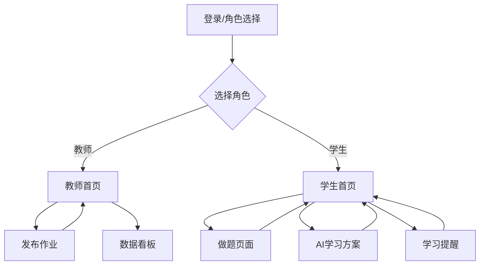

## 1. Product Overview
智慧学堂是一款AI辅助教学微信小程序，旨在帮助教师高效管理作业和帮助学生获得个性化学习体验。
- 解决教师批改作业耗时、学生学习缺乏个性化指导的问题，目标用户为教师和学生。
- 通过AI技术提供个性化学习方案和学习提醒，提升教学效果和学习效率。

## 2. Core Features

### 2.1 User Roles
| 角色 | 注册方式 | 核心权限 |
|------|----------|----------|
| 教师 | 微信授权登录 + 角色选择 | 发布作业、查看班级数据看板 |
| 学生 | 微信授权登录 + 角色选择 | 在线做题、查看AI学习方案、设置学习提醒 |

### 2.2 Feature Module
1. **登录/角色选择页面**：微信授权登录、教师/学生角色选择
2. **教师端**：
   - 教师首页（作业管理）
   - 发布作业页面
   - 班级数据看板
3. **学生端**：
   - 学生首页（作业列表）
   - 做题页面
   - AI学习方案页面
   - 学习提醒页面

### 2.3 Page Details
| 页面名称 | 模块名称 | 功能描述 |
|---------|---------|----------|
| 登录/角色选择页面 | 登录模块 | 微信授权登录，选择教师/学生角色 |
| 教师首页 | 作业管理模块 | 显示已发布的作业列表，支持查看作业详情 |
| 发布作业页面 | 作业编辑模块 | 输入作业标题、选择学科、动态添加题目（含选项和答案）、发布作业 |
| 班级数据看板 | 数据统计模块 | 班级平均分显示、学生成绩排名、薄弱知识点TOP5柱状图、最近提交记录 |
| 学生首页 | 作业列表模块 | 显示待做和已做的作业列表，支持进入做题页面 |
| 做题页面 | 答题模块 | 显示题目和选项、选择答案、提交作业、自动判卷显示得分 |
| AI学习方案页面 | 方案生成模块 | 基于做题数据生成个性化学习方案、显示学习状况评估、薄弱知识点、学习建议和鼓励语 |
| 学习提醒页面 | 提醒设置模块 | 设置提醒时间和频率、生成AI鼓励语、查看已设置的提醒 |

## 3. Core Process
### 教师流程
1. 教师登录并选择教师角色
2. 进入教师首页，查看已发布的作业
3. 点击发布作业，填写作业信息并添加题目
4. 发布作业后返回教师首页
5. 进入数据看板查看班级学习情况

### 学生流程
1. 学生登录并选择学生角色
2. 进入学生首页，查看待做的作业
3. 选择作业进入做题页面，完成答题并提交
4. 查看得分后返回学生首页
5. 进入AI学习方案页面，生成个性化学习方案
6. 进入学习提醒页面，设置学习提醒并获取AI鼓励语

## 4. User Interface Design
### 4.1 Design Style
- 主色调：蓝色系 (#1976D2) 和白色 (#FFFFFF)
- 辅助色：浅蓝 (#BBDEFB)、橙色 (#FF9800)
- 按钮样式：圆角按钮，有轻微的阴影效果
- 字体：系统默认字体，标题16-18px，正文14px，辅助文字12px
- 布局风格：卡片式布局，清晰的视觉层次
- 图标风格：使用简洁的线性图标，符合微信小程序设计规范

### 4.2 Page Design Overview
| 页面名称 | 模块名称 | UI元素 |
|---------|---------|--------|
| 登录/角色选择页面 | 登录模块 | 微信授权登录按钮居中显示，角色选择使用卡片式切换，整体风格简洁明亮 |
| 教师首页 | 作业管理模块 | 顶部标题栏，作业列表使用卡片展示，包含作业标题、学科、发布时间等信息，右下角有发布作业的浮动按钮 |
| 发布作业页面 | 作业编辑模块 | 表单式布局，标题输入框、学科选择器、题目列表（每道题包含题目输入、选项输入、答案选择），底部有添加题目和发布按钮 |
| 班级数据看板 | 数据统计模块 | 顶部显示班级平均分，中间是学生成绩排名列表，下方是薄弱知识点柱状图，底部是最近提交记录 |
| 学生首页 | 作业列表模块 | 作业列表使用卡片展示，区分待做和已做状态，包含作业标题、学科、截止时间等信息 |
| 做题页面 | 答题模块 | 顶部显示题号和题目文本，中间是ABCD四个选项卡片（点击选中高亮），底部是上一题/下一题/提交按钮 |
| AI学习方案页面 | 方案生成模块 | 顶部有生成学习方案按钮，下方是学习状况评估卡片、薄弱知识点标签列表、学习建议列表、AI鼓励语卡片 |
| 学习提醒页面 | 提醒设置模块 | 时间选择器、频率选择器、生成AI鼓励语按钮，下方是已设置的提醒列表 |

### 4.3 Responsiveness
- 采用移动端优先设计，适配不同尺寸的微信小程序界面
- 触摸优化：按钮和可点击区域大小合适，操作反馈及时
- 布局自适应：在不同屏幕尺寸下保持良好的视觉效果和操作体验

### 4.4 3D Scene Guidance
- 本项目不涉及3D场景设计