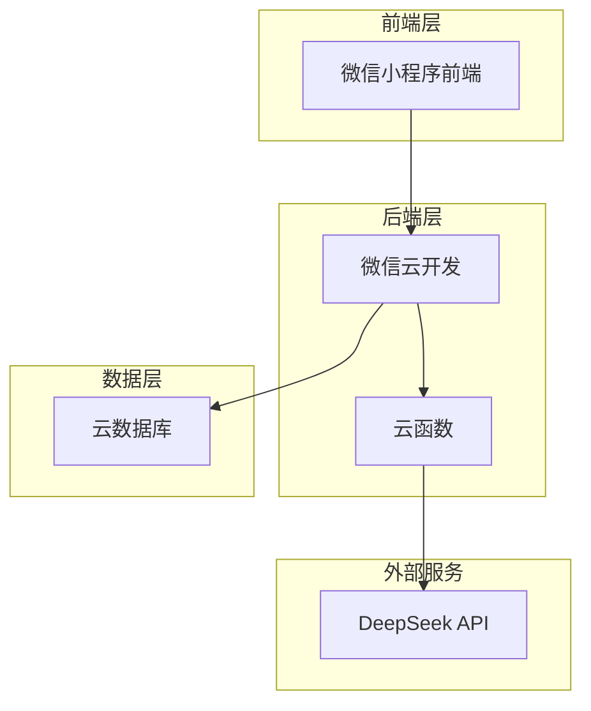
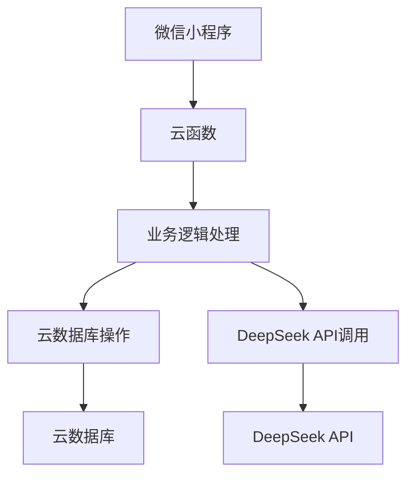
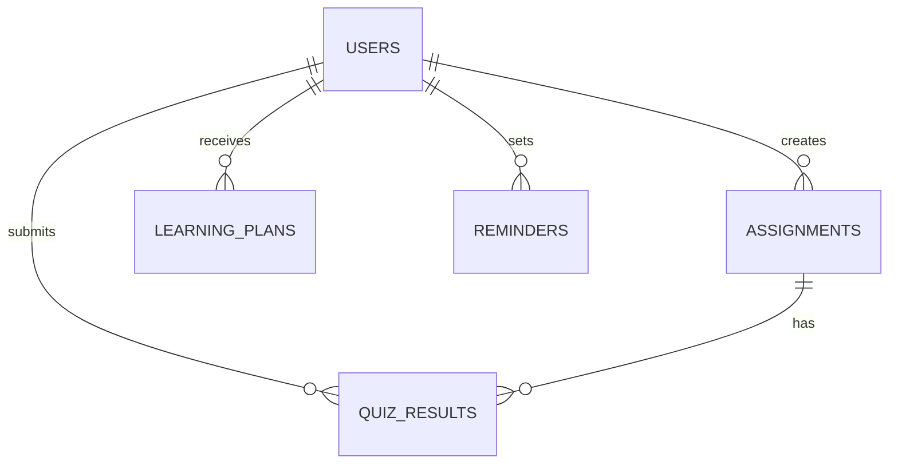

## 1. Architecture Design

## 2. Technology Description
- 前端：微信小程序原生框架 (WXML + WXSS + JavaScript)
- 后端：微信云开发（云函数 + 云数据库）
- AI能力：DeepSeek API (SiliconFlow)
- UI组件库：Vant Weapp
- 图表：ECharts for WeChat

## 3. Route Definitions
| 页面路径 | 功能描述 |
|---------|----------|
| /pages/login | 登录/角色选择页面 |
| /pages/teacher/home | 教师首页（作业管理） |
| /pages/teacher/create | 发布作业页面 |
| /pages/teacher/dashboard | 班级数据看板 |
| /pages/student/home | 学生首页（作业列表） |
| /pages/student/quiz | 做题页面 |
| /pages/student/plan | AI学习方案页面 |
| /pages/student/reminder | 学习提醒页面 |

## 4. API Definitions
### 4.1 云函数API

#### login
- **功能**：处理用户登录和角色设置
- **参数**：
  - `role`: String (teacher/student)
  - `userInfo`: Object (用户信息)
- **返回**：
  - `success`: Boolean
  - `user`: Object (用户信息)

#### assignment
- **功能**：作业CRUD操作
- **参数**：
  - `action`: String (create/read/update/delete)
  - `data`: Object (作业数据)
- **返回**：
  - `success`: Boolean
  - `data`: Object/Array (作业数据)

#### quiz
- **功能**：做题与判卷
- **参数**：
  - `action`: String (submit/get)
  - `data`: Object (做题数据)
- **返回**：
  - `success`: Boolean
  - `score`: Number (得分)
  - `data`: Object (做题结果)

#### ai-service
- **功能**：DeepSeek API调用
- **参数**：
  - `action`: String (generatePlan/generateEncouragement)
  - `data`: Object (相关数据)
- **返回**：
  - `success`: Boolean
  - `plan`: String (学习方案)
  - `encouragement`: String (鼓励语)

## 5. Server Architecture Diagram

## 6. Data Model
### 6.1 Data Model Definition

### 6.2 Data Definition Language
#### users 集合
- `_id`: String (主键)
- `openid`: String (微信用户唯一标识)
- `name`: String (用户名)
- `role`: String (teacher/student)
- `avatarUrl`: String (头像URL)

#### assignments 集合
- `_id`: String (主键)
- `teacherId`: String (教师ID)
- `title`: String (作业标题)
- `subject`: String (学科)
- `questions`: Array (题目列表)
  - `question`: String (题目文本)
  - `options`: Array (选项列表)
  - `correctAnswer`: Number (正确答案索引)
- `createdAt`: Date (创建时间)

#### quiz_results 集合
- `_id`: String (主键)
- `studentId`: String (学生ID)
- `assignmentId`: String (作业ID)
- `answers`: Array (答案列表)
- `score`: Number (得分)
- `duration`: Number (做题时长，秒)
- `createdAt`: Date (提交时间)

#### learning_plans 集合
- `_id`: String (主键)
- `studentId`: String (学生ID)
- `content`: String (学习方案内容，Markdown格式)
- `createdAt`: Date (创建时间)

#### reminders 集合
- `_id`: String (主键)
- `studentId`: String (学生ID)
- `time`: String (提醒时间)
- `frequency`: String (提醒频率，每天/每周)
- `message`: String (提醒消息)
- `aiMessage`: String (AI生成的鼓励语)
- `isActive`: Boolean (是否激活)
